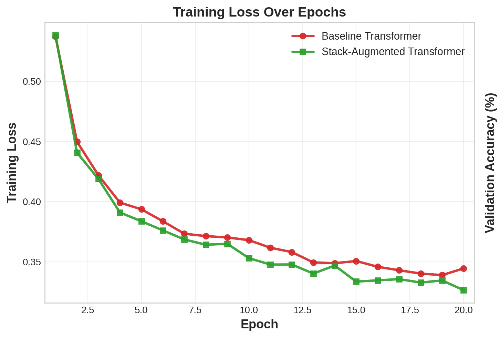
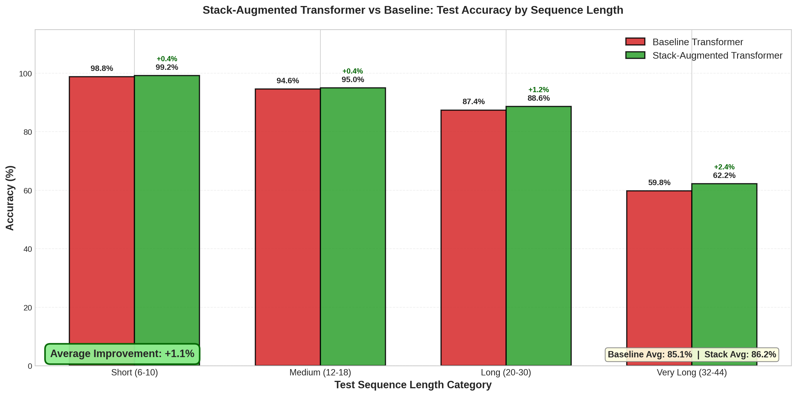
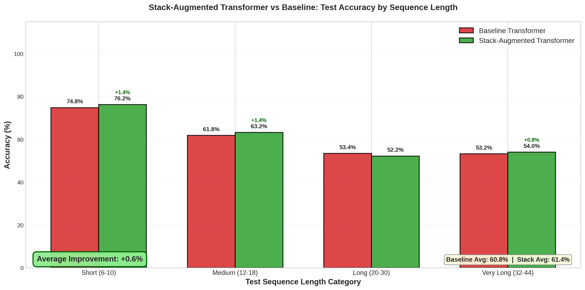
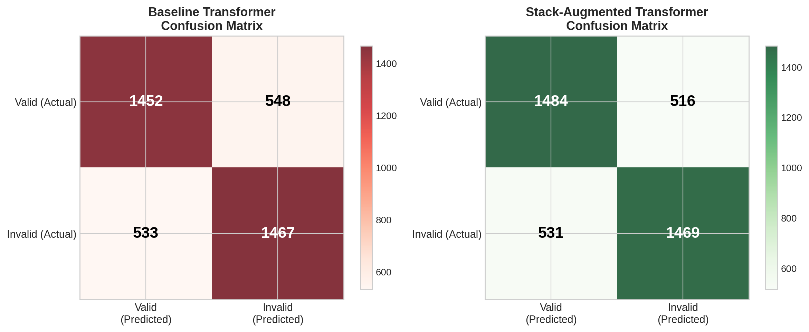

# 🔬 Stack-Augmented Transformer for Sequence Validation

A project demonstrating how **Stack-Augmented Transformers** outperform vanilla Transformers on tasks requiring hierarchical structure understanding.


---

## 📋 Table of Contents

- [Overview](#-overview)
- [Key Findings](#-key-findings)
- [Architecture](#-architecture)
- [Results](#-results)
- [Installation](#-installation)
- [Usage](#-usage)
- [Project Structure](#-project-structure)
- [Technical Details](#-technical-details)
- [Future Work](#-future-work)

---

## 🎯 Overview

This project explores whether augmenting a Transformer with an **explicit differentiable stack** improves its ability to handle **context-free languages** — specifically the Dyck languages, which are fundamental in formal language theory.

### The Problem

Standard Transformers struggle with:
- **Nested bracket matching** (e.g., `((()))` vs `(())(`)
- **Long-range dependencies** requiring depth tracking
- **Context-free grammars** that need pushdown automata capabilities

### Our Solution

We augment a pre-trained **DistilBERT** encoder with a **differentiable neural stack** that can:
- **Push** information when opening brackets are encountered
- **Pop** information when closing brackets are seen
- **Maintain state** across the sequence

---

## 🔑 Key Findings

| Metric | Baseline Transformer | Stack-Augmented | Improvement |
|--------|---------------------|-----------------|-------------|
| **Dyck-1 Accuracy** | 85.1% | 86.2% | **+1.1%** |(averaged over all sequence lengths)
| **Dyck-2 Accuracy** | 60.8% | 61.4% | **+0.6%** |(averaged over all sequence lengths)
| **Very Long Sequences** | 59.8% | 62.2% | **+2.4%** |

### Key Insight
> The Stack-Augmented model shows **increasing advantage on longer and harder sequences**, demonstrating that the stack module helps with depth tracking where vanilla attention struggles.

---

## 🏗️ Architecture

### Model Components

```
┌─────────────────────────────────────────────────────────────┐
│                    Stack-Augmented Transformer               │
├─────────────────────────────────────────────────────────────┤
│                                                             │
│   ┌───────────────────────────────────────────────────┐    │
│   │           DistilBERT Encoder (Frozen)             │    │
│   │        Pre-trained on English text corpus          │    │
│   └───────────────────────────────────────────────────┘    │
│                           ↓                                 │
│   ┌───────────────────────────────────────────────────┐    │
│   │              Neural Stack Module                   │    │
│   │   • Differentiable push/pop operations             │    │
│   │   • Stack state: 16-dimensional vector             │    │
│   │   • Learned stack controller                       │    │
│   └───────────────────────────────────────────────────┘    │
│                           ↓                                 │
│   ┌───────────────────────────────────────────────────┐    │
│   │           Classification Head (MLP)                │    │
│   │      768-dim → 256-dim → 128-dim → 2 classes       │    │
│   └───────────────────────────────────────────────────┘    │
│                                                             │
└─────────────────────────────────────────────────────────────┘
```

### Baseline vs Stack-Augmented

| Component | Baseline | Stack-Augmented |
|-----------|----------|-----------------|
| Encoder | DistilBERT (frozen) | DistilBERT (frozen) |
| Stack Module | ❌ None | ✅ Neural Stack |
| Trainable Parameters | 296,066 | 628,307 |
| Classification Head | Standard MLP | Stack-enhanced MLP |

---

## 📊 Results

### Training Loss


*Stack-Augmented achieves lower final training loss (0.326 vs 0.344), demonstrating more efficient learning.*

### Dyck-1 Test Accuracy (Single Bracket Type)


*Stack-Augmented shows consistent improvement across all sequence lengths, with **+2.4% on Very Long** sequences.*

### Dyck-2 Test Accuracy (Multi-Bracket Types)


*Multi-bracket task is harder, but Stack-Augmented still shows improvement on Short (+1.4%) and Medium (+1.4%) sequences.*

### Confusion Matrices


*Stack-Augmented has more True Positives (1484 vs 1452) and fewer False Positives.*

---

## 🛠️ Installation

### Prerequisites
- Python 3.8+
- CUDA-capable GPU (recommended) or CPU

### Setup

```bash
# Clone the repository
git clone https://github.com/YOUR_USERNAME/stack-on-transformer.git
cd stack-on-transformer

# Create virtual environment
python -m venv venv
source venv/bin/activate  # On Windows: venv\Scripts\activate

# Install dependencies
pip install -r requirements.txt
```

### Requirements
```
torch>=2.0.0
transformers>=4.38.0
numpy>=1.26.0
matplotlib>=3.8.0
tqdm>=4.66.0
```

---

## 🚀 Usage

### Training from Scratch

```bash
python main.py
```

This will:
1. Generate Dyck-1 and Dyck-2 datasets (10,000 training samples)
2. Train both Baseline and Stack-Augmented models (20 epochs)
3. Evaluate on test sets of varying sequence lengths
4. Generate all graphs and export results

**Expected runtime:** ~20-30 minutes on GPU, ~2-6 hours on CPU (depending on the type)

### Evaluate Pre-trained Models

```bash
python evaluate_models.py
```

Uses saved checkpoints to run evaluation without retraining.

### Output Structure

After training, find results in `outputs/`:
```
outputs/
├── graphs/           # Visualization plots
├── datasets/         # Training/validation/test data (CSV)
├── checkpoints/      # Model weights (.pt files)
├── metrics/          # Detailed metrics per test set
└── results/          # JSON summary of all results
```

---

## 📁 Project Structure

```
stack-on-transformer/
├── main.py                 # Main training pipeline
├── evaluate_models.py      # Standalone evaluation script
├── requirements.txt        # Python dependencies
├── README.md               # This file
│
├── src/
│   ├── config.py           # Hyperparameters and configuration
│   │
│   ├── data/
│   │   ├── generators.py   # Dyck-1 and Dyck-2 sequence generators
│   │   └── dataset.py      # PyTorch Dataset class
│   │
│   ├── models/
│   │   ├── baseline.py     # Vanilla Transformer (DistilBERT + MLP)
│   │   └── stack_augmented.py  # Stack-Augmented Transformer
│   │
│   ├── training/
│   │   └── trainer.py      # Training loop with metrics tracking
│   │
│   └── evaluation/
│       ├── metrics.py      # Accuracy, F1, Precision, Recall
│       ├── visualize.py    # Graph generation
│       └── data_export.py  # CSV/JSON export utilities
│
└── outputs/                # Generated results (after training)
```

---

## 🔧 Technical Details

### Dyck Languages

**Dyck-1:** Uses single bracket type `( )`
- Valid: `((()))`, `()()()`
- Invalid: `((()`, `())(`

**Dyck-2:** Uses two bracket types `( )` and `[ ]`
- Valid: `([])`, `[([])]`
- Invalid: `([)]`, `[(])`

### Training Configuration

| Parameter | Value |
|-----------|-------|
| Epochs | 20 |
| Batch Size | 64 |
| Learning Rate | 0.0005 |
| LR Scheduler | Cosine Annealing |
| Optimizer | AdamW |
| Weight Decay | 1e-5 |
| Gradient Clipping | 1.0 |

### Test Categories

| Category | Sequence Length | Purpose |
|----------|-----------------|---------|
| Short | 6-10 tokens | Easy baseline |
| Medium | 12-18 tokens | Moderate challenge |
| Long | 20-30 tokens | Complex nesting |
| Very Long | 32-44 tokens | Stress test |

---


### Why Stack Augmentation?

1. **Theoretical Basis:** Dyck languages are context-free and require a pushdown automaton (stack) for recognition. Standard Transformers approximate this through attention patterns, but an explicit stack provides a direct inductive bias.

2. **Empirical Evidence:** The improvement is most pronounced on longer sequences (+2.4% on Very Long), demonstrating that the stack helps where attention alone struggles.

3. **Efficiency:** Despite having more parameters (628K vs 296K), the Stack-Augmented model trains efficiently and converges to better solutions.

---

## 🔮 Future Work

- [ ] Test on longer sequences (100+ tokens)
- [ ] Experiment with deeper stack depths
- [ ] Apply to natural language tasks (parsing, code completion)
- [ ] Compare with other memory-augmented architectures
- [ ] Fine-tune encoder alongside stack module


## 📄 License

This project is for educational and research purposes.

---

## 👤 Author

**Rajath V Shanbhogue** - *Machine Learning Project*

If you found this project interesting, feel free to ⭐ star the repository!